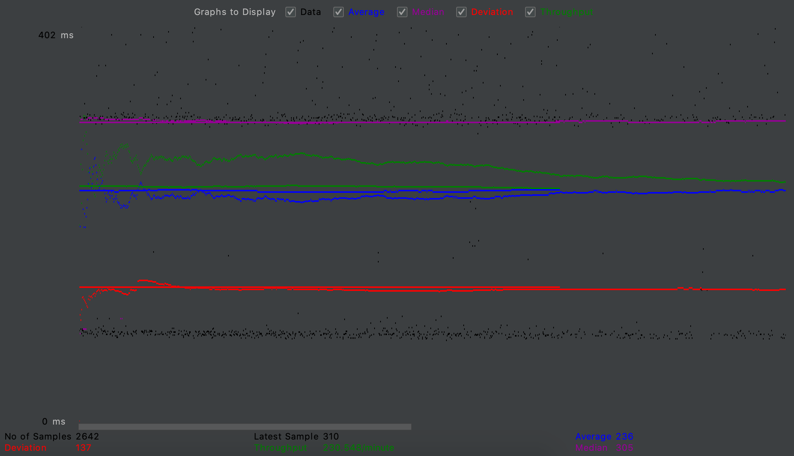
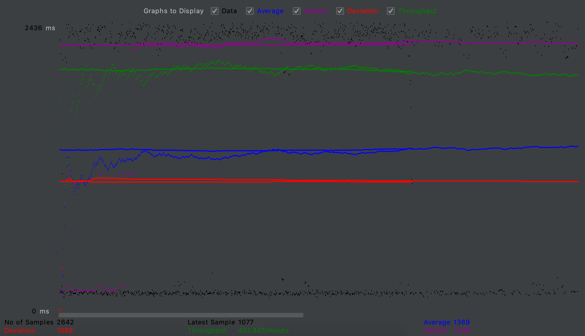
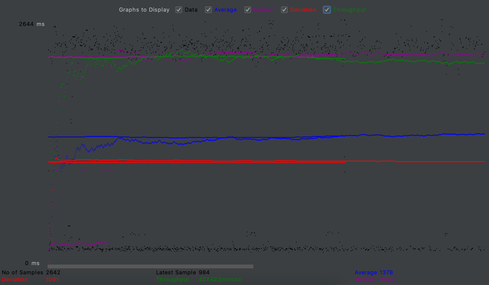
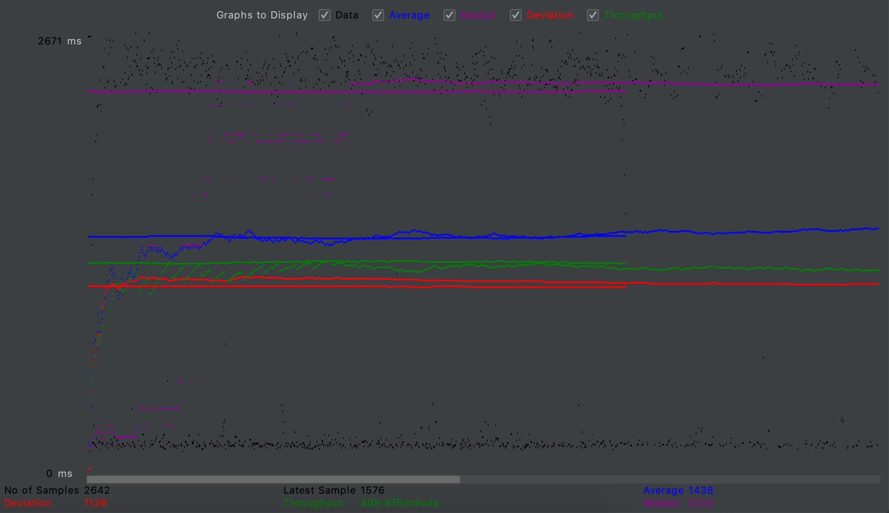
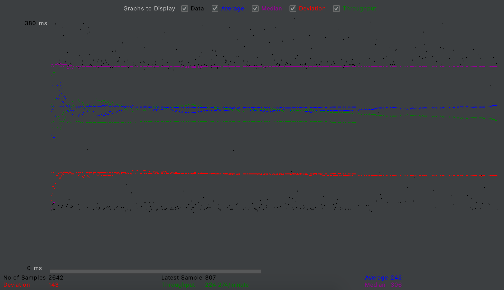
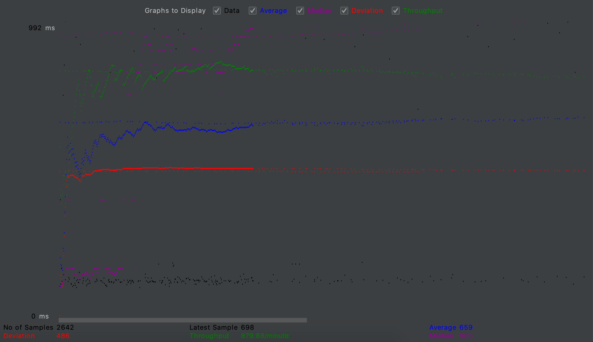
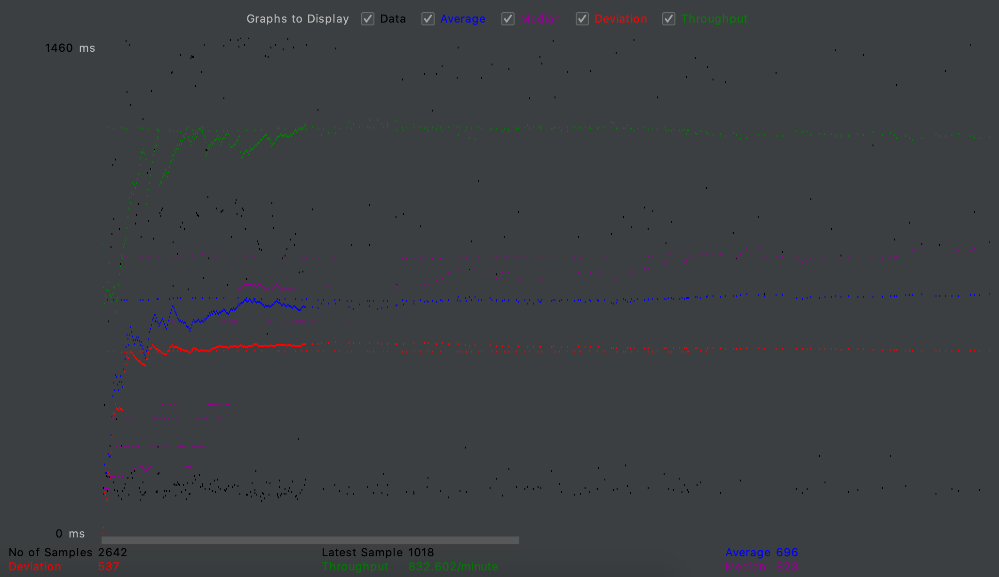

- # General
    - #### Team#: 91
    
    - #### Names: Kevin Norgaard
    
    - #### Project 5 Video Demo Link: https://www.youtube.com/watch?v=Qqh9RRWeOAM

    - #### Instruction of deployment:
        1. Run `git clone https://github.com/UCI-Chenli-teaching/cs122b-spring20-team-91`
        2. Add `RecaptchaConstants.java` file to `webapp/src/main/java/`
        3. In the root directory, run `mvn clean package` to compile & install dependencies
        4. Run `cp ./target/*.war /home/ubuntu/tomcat/webapps`
        5. Build and deploy APK for Android app in `./mobile` directory

    - #### Collaborations and Work Distribution:
       Kevin Norgaard (everything):
        - Connection Pooling
        - Master/slave
        - Load balancing
        - Log Processing Script
        - JMeter TS/TJ Time Measurement Report
        - Log files

- # Connection Pooling
    - #### Include the filename/path of all code/configuration files in GitHub of using JDBC Connection Pooling.
        - webapp/web/META-INF/context.xml https://github.com/UCI-Chenli-teaching/cs122b-spring20-team-91/blob/master/webapp/web/META-INF/context.xml
        - webapp/web/WEB-INF/web.xml https://github.com/UCI-Chenli-teaching/cs122b-spring20-team-91/blob/master/webapp/web/WEB-INF/web.xml
        - webapp/src/CartServlet.java https://github.com/UCI-Chenli-teaching/cs122b-spring20-team-91/blob/master/webapp/src/main/java/CartServlet.java
        - webapp/src/DashboardLoginServlet.java https://github.com/UCI-Chenli-teaching/cs122b-spring20-team-91/blob/master/webapp/src/main/java/DashboardLoginServlet.java
        - webapp/src/DashboardServlet.java https://github.com/UCI-Chenli-teaching/cs122b-spring20-team-91/blob/master/webapp/src/main/java/DashboardServlet.java
        - webapp/src/GenresServlet.java https://github.com/UCI-Chenli-teaching/cs122b-spring20-team-91/blob/master/webapp/src/main/java/GenresServlet.java
        - webapp/src/LoginServlet.java https://github.com/UCI-Chenli-teaching/cs122b-spring20-team-91/blob/master/webapp/src/main/java/LoginServlet.java
        - webapp/src/MetadataServlet.java https://github.com/UCI-Chenli-teaching/cs122b-spring20-team-91/blob/master/webapp/src/main/java/MetadataServlet.java
        - webapp/src/MovieServlet.java https://github.com/UCI-Chenli-teaching/cs122b-spring20-team-91/blob/master/webapp/src/main/java/MovieServlet.java
        - webapp/src/MoviesServlet.java https://github.com/UCI-Chenli-teaching/cs122b-spring20-team-91/blob/master/webapp/src/main/java/MoviesServlet.java
        - webapp/src/PaymentServlet.java https://github.com/UCI-Chenli-teaching/cs122b-spring20-team-91/blob/master/webapp/src/main/java/PaymentServlet.java
        - webapp/src/StarServlet.java https://github.com/UCI-Chenli-teaching/cs122b-spring20-team-91/blob/master/webapp/src/main/java/StarServlet.java
    
    - #### Explain how Connection Pooling is utilized in the Fabflix code.
        - The MySQL DB data source is looked up from the Context (defined in `context.xml`). Then from the data source, we can get a connection to query the database.
        - Connection Pooling sets the maximum number of connections (100), maximum idle connections allowed (30), and a timeout for waiting (10 sec). 
        - When `getConnection()` is called, pre-created connection is used upon lookup.
        - When `connection.close()` is called, the connections is placed back into the pool.
        
    - #### Explain how Connection Pooling works with two backend SQL.
        - Two SQL backends can be defined in `context.xml` and `web.xml`. They can both be fetched by their unique resource names, using `envContext.lookup(resourceName)`.
       

- # Master/Slave
    - #### Include the filename/path of all code/configuration files in GitHub of routing queries to Master/Slave SQL.
        - webapp/web/META-INF/context.xml https://github.com/UCI-Chenli-teaching/cs122b-spring20-team-91/blob/master/webapp/web/META-INF/context.xml
        - webapp/web/WEB-INF/web.xml https://github.com/UCI-Chenli-teaching/cs122b-spring20-team-91/blob/master/webapp/web/WEB-INF/web.xml
        - webapp/src/CartServlet.java https://github.com/UCI-Chenli-teaching/cs122b-spring20-team-91/blob/master/webapp/src/main/java/CartServlet.java
        - webapp/src/DashboardLoginServlet.java https://github.com/UCI-Chenli-teaching/cs122b-spring20-team-91/blob/master/webapp/src/main/java/DashboardLoginServlet.java
        - webapp/src/DashboardServlet.java https://github.com/UCI-Chenli-teaching/cs122b-spring20-team-91/blob/master/webapp/src/main/java/DashboardServlet.java
        - webapp/src/GenresServlet.java https://github.com/UCI-Chenli-teaching/cs122b-spring20-team-91/blob/master/webapp/src/main/java/GenresServlet.java
        - webapp/src/LoginServlet.java https://github.com/UCI-Chenli-teaching/cs122b-spring20-team-91/blob/master/webapp/src/main/java/LoginServlet.java
        - webapp/src/MetadataServlet.java https://github.com/UCI-Chenli-teaching/cs122b-spring20-team-91/blob/master/webapp/src/main/java/MetadataServlet.java
        - webapp/src/MovieServlet.java https://github.com/UCI-Chenli-teaching/cs122b-spring20-team-91/blob/master/webapp/src/main/java/MovieServlet.java
        - webapp/src/MoviesServlet.java https://github.com/UCI-Chenli-teaching/cs122b-spring20-team-91/blob/master/webapp/src/main/java/MoviesServlet.java
        - webapp/src/PaymentServlet.java https://github.com/UCI-Chenli-teaching/cs122b-spring20-team-91/blob/master/webapp/src/main/java/PaymentServlet.java
        - webapp/src/StarServlet.java https://github.com/UCI-Chenli-teaching/cs122b-spring20-team-91/blob/master/webapp/src/main/java/StarServlet.java

    - #### How read/write requests were routed to Master/Slave SQL?
        - The reads route to the localhost IP address
        - The writes route to the Master SQL private IP address `172.31.54.13`

- # JMeter TS/TJ Time Logs
    - #### Instructions of how to use the `log_processing.py` script to process the JMeter logs.
        1. cd to the `./logs` directory to locate the script
        2. Edit the first line: change the file name/path to the log to be processed.
        3. Run the script with command: `python3 log_processing.py`

- # JMeter TS/TJ Time Measurement Report

| **Single-instance Version Test Plan**          | **Graph Results Screenshot** | **Average Query Time(ms)** | **Average Search Servlet Time(ms)** | **Average JDBC Time(ms)** | **Analysis** |
|------------------------------------------------|------------------------------|----------------------------|-------------------------------------|---------------------------|--------------|
| Case 1: HTTP/1 thread                          |    | 236                         | 131.94                                  | 131.79                        | Response time is fastest of all tests because there is no overhead from load balancer. Bottleneck is mainly in the network speed.           |
| Case 2: HTTP/10 threads                        |    | 1369                         | 1276.70                                  | 1276.56                        | The JDBC response time is about 10x higher due to 10 different users.           |
| Case 3: HTTPS/10 threads                       |    | 1378                         | 1281.17                                  | 1280.95                        | Slightly longer response time due to SSL encryption overhead.           |
| Case 4: HTTP/10 threads/No connection pooling  |    | 1438                         | 1343.34                                  | 1343.23                        | Slowest response time because the JDBC connection is not pooled and must be created each time.           |

| **Scaled Version Test Plan**                   | **Graph Results Screenshot** | **Average Query Time(ms)** | **Average Search Servlet Time(ms)** | **Average JDBC Time(ms)** | **Analysis** |
|------------------------------------------------|------------------------------|----------------------------|-------------------------------------|---------------------------|--------------|
| Case 1: HTTP/1 thread                          |    | 245                         | 131.28                                  | 131.08                        | Slower response time than single-instance because of load balancer overhead           |
| Case 2: HTTP/10 threads                        |    | 659                         | 572.28                                  | 572.10                        | Response time is about half that of single-instance because the traffic is split in half (handled by 2 instances)           |
| Case 3: HTTP/10 threads/No connection pooling  |    | 696                         | 605.53                                  | 605.38                        | Slower response time because the JDBC connection is not pooled and must be created each time.           |